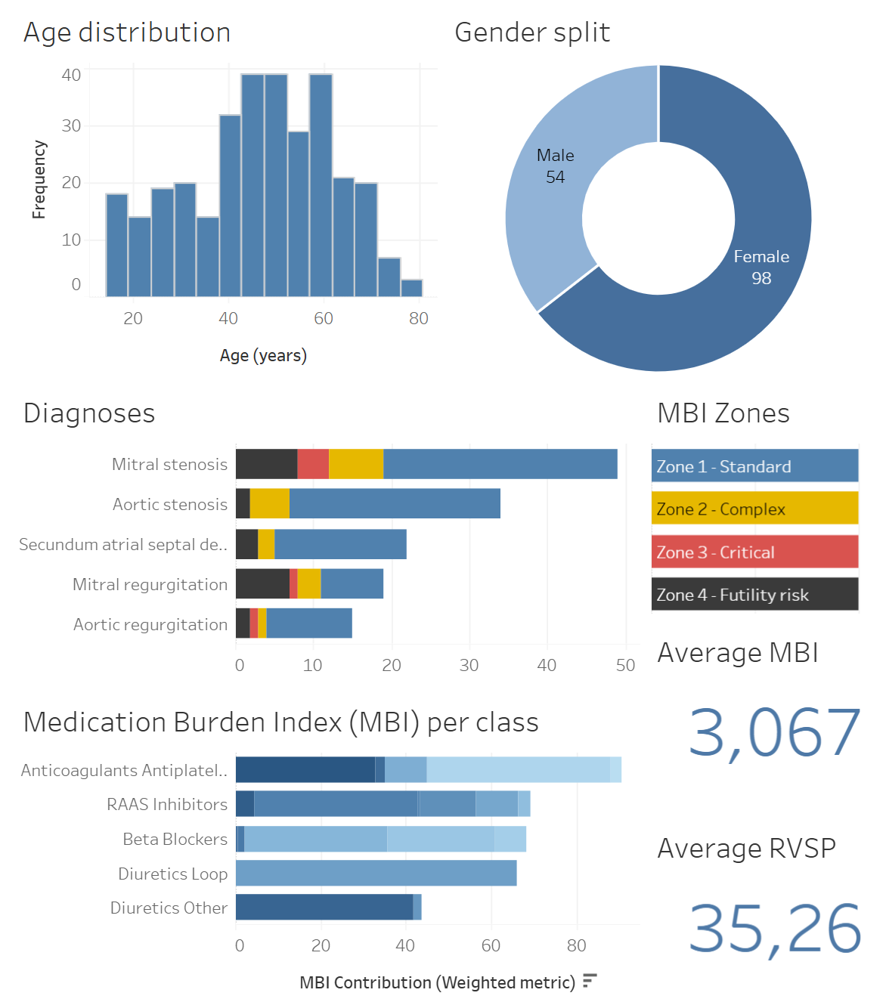
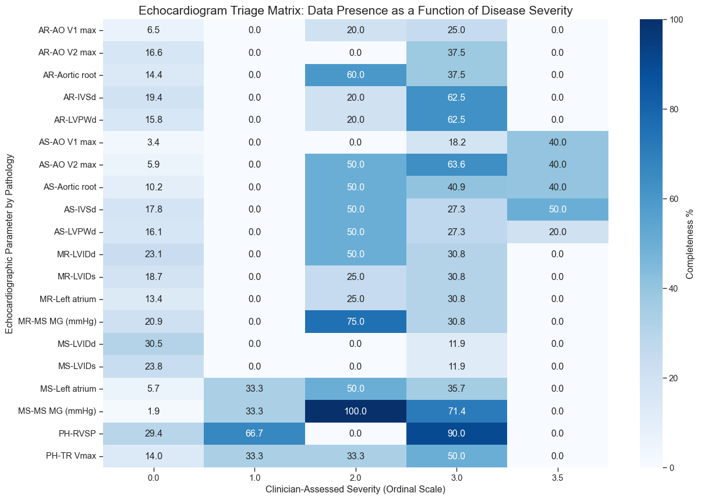
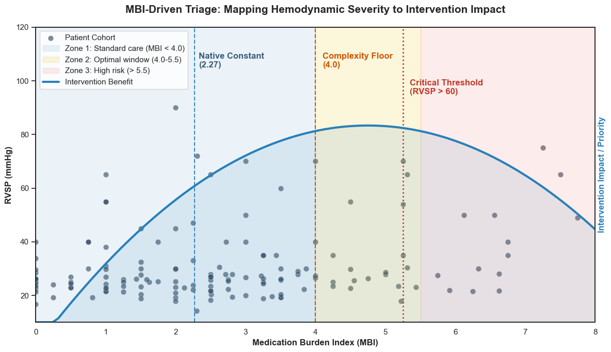

# Quantifying Clinical Gaps in Valvular Heart Disease: Using the Medication Burden Index (MBI) to Triage High-Complexity Intervention Candidates.

## Project background

This analysis evaluates real-world clinical data from a high-volume humanitarian cardiology mission in León, Nicaragua. Operating as an acute specialty-care delivery model, the mission bridges the gap between primary community screening and advanced tertiary cardiac intervention through a structured, three-phase clinical workflow:

* **Phase 1 — General Cardiology Clinic:** High-throughput diagnostic screening, echocardiographic evaluation, and procedure prioritization.

* **Phase 2 — Electrophysiology:** Arrhythmia management, including cardiac ablations and permanent pacemaker/ICD implantation.

* **Phase 3 — Interventional Cardiology:** Percutaneous structural heart procedures and collaborative case reviews.

From the perspective of a Data Analyst embedded within the mission, this project evaluates the Phase 1 — 2025 Cohort. To focus analysis on adult structural heart disease and maximize intervention yield, the baseline population ($N = 187$) was filtered to exclude patients under 15 years old and those with entirely normal echocardiographic findings, yielding a final analytical sample of $N = 152$ patients.

Insights and recommendations are provided on the following key areas:

- **[Forensic data audit](#forensic-data-audit)**
- **[Natural Normal Gaussian Imputation & Sensitivity Analysis](#natural-normal-gaussian-imputation--sensitivity-analysis)**
- **[Medication Burden Index (MBI) as a Triage Tool](#medication-burden-index-mbi-as-a-triage-tool)**

### Project Resources & Links

- **[Data Transformation & Engineering Notebook](https://github.com/enaromd/Cardio-MBI-Triage-Engine/blob/main/notebooks/01_extraction_transformation.ipynb)**
- **[Centralized Configuration ("Medical Brain")](https://github.com/enaromd/Cardio-MBI-Triage-Engine/blob/main/modules/config.py)**
- **[Data Analysis Notebook](https://github.com/enaromd/Cardio-MBI-Triage-Engine/blob/main/notebooks/03_analysis.ipynb)**
- **[Interactive Mission Triage Dashboard](https://public.tableau.com/app/profile/enyel.a.rodr.guez.g./viz/MBIstratification/MBIstratification)**

## Data structure & initial checks

The project's underlying MySQL database structure, engineered from digitized bedside charts to power the Tableau dashboard, consists of five tables anchored on $N = 152$ patient records. A description of each table is as follows:

- `fact_patient`: Primary anchor table containing individual demographic baselines, triage vitals, and continuous quantitative echocardiographic parameters ($N = 152$).  

- `dim_diagnoses`: Reference dimension table enforcing normalized diagnostic nomenclature, valvular lesion types, and severity classifications.

- `dim_medications`: Reference dimension table cataloging pharmacological agents, therapeutic drug classes, and maximum daily dose limits required for dosage normalization.

- `bridge_diagnoses`: Associative bridge table resolving many-to-many relationships between patients and complex multi-valvular disease presentations.

- `bridge_medications`: Associative bridge table mapping polypharmacy regimens to patients, enabling granular MBI score calculations without duplicating core demographic rows.

## Executive summary

### Overview of findings

An audit of the 2025 General Cardiology Clinic ($N=152$) reveals that missingness in echocardiographic parameters is Missing Not At Random (MNAR), driven by clinicians selectively omitting quantitative measurements when qualitative scans show non-pathological features. To prevent dropping $80\%$ of incomplete patient cases, the pipeline applies Natural Normal Gaussian Imputation to unmeasured echo fields, preserving true population variance without distorting clinical risk.

By pairing structural echo severity with the engineered Medication Burden Index (MBI), this pipeline introduces a Diagnostic Discordance Framework. Uncovering divergence between anatomical disease (echo) and pharmacological intensity (MBI) exposes a baseline Native Constant ($MBI = 2.27$) and a Critical Red Flag Threshold ($MBI = 5.25$), operationalizing MBI as an objective, point-of-registration triage score to prioritize high-yield intervention candidates and catch end-stage hemodynamic decompensation.

## Insights deep dive

### Forensic data audit

- **Triage Vitals Achieve 99.67% Completeness:** Physical and physiological safety metrics recorded a missingness rate of $0.33\%$ ($n=151.5$ complete records), verifying that frontline nursing triage captures baseline parameters reliably across the entire cohort.

- **Structural Dimensions Exhibit 81.77% Selective Sparsity:** Anatomical dimension parameters ($\text{IVSd, LVIDd, LVPWd, LVIDs}$) showed an average missingness of $81.77\%$, confirming that clinicians document precise caliper measurements primarily when obvious chamber enlargement is observed.

- **Hemodynamic Metrics Dropout at 66.89%:** Functional echo variables ($\text{TR Vmax, RVSP, MS MG}$) showed $66.89\%$ missingness, with peak pressure gradients recorded almost exclusively during active valvular regurgitation or stenosis.

### Natural Normal Gaussian Imputation & Sensitivity Analysis

- **Full Cohort Retention ($N=152$):** Natural Normal Gaussian Imputation preserved $100\%$ of patient records ($N=152$), salvaging $122$ high-acuity cases that traditional deletion algorithms would have discarded.

- **Kernel Density Estimation (KDE) Variance Stability:** Density plots verify that Natural Normal imputation populates unmeasured anatomical fields around normal physiological centers without artificially collapsing variance into a single point-estimate mean.

- **Logical Mean Shifts in Sensitivity Audits:** Comparing the raw measured sub-cohort against the fully imputed population demonstrated expected, non-biased mean shifts (e.g., mean $LVIDd$ shifting toward healthy reference intervals) while keeping overall risk tiering intact.

### Medication Burden Index (MBI) as a Triage Tool

- **Establishing the "Native Constant" ($MBI = 2.27$):** Statistical modeling identifies $2.27$ as the cohort's baseline medication burden. A patient at this score represents a standard, stable valvular case.

- **The Complexity Floor ($MBI = 4.0$):** Setting the entry floor for high-priority intervention at 4.0 captures the top 25% of cohort severity. For example, combining the baseline Native Constant ($2.27$) with the additive risk coefficient of a Mixed Mitral lesion ($2.22$) yields $MBI \approx 4.5$, proving that an MBI of $4.0$ mathematically isolates complex multi-lesion phenotypes requiring intense pharmacological support.

- **The Critical Threshold Red Flag ($MBI = 5.25$):** Crossing an MBI of $5.25$ marks the point where medical therapy fails to mask underlying disease. This cutoff predicts Critical Pulmonary Hypertension ($RVSP > 60 mmHg$) with $85\%$ Precision, capturing a cohort with high mean RVSP ($48.0 \pm 34.3 mmHg$) and high female prevalence ($88.2\%$).

## Recommendations

Based on the insights and findings above, we would recommend the cardiology mission team to consider the following:

- **Operationalize $MBI = 5.25$ as a Point-of-Registration Red Flag.** Calculate MBI at check-in. Patients scoring $\ge 5.25$ should bypass general queueing and be routed to priority echocardiography and senior specialist evaluation.

- **Target Zone 2 ($MBI = 4.0 - 5.5$) for Primary Intervention Case Selection.** Prioritize Zone 2 patients ($MBI = 4.0 - 5.5$) for interventional and surgical case candidate lists, maximizing procedural yield before patients cross into end-stage failure ($MBI > 5.5$).

- **Deploy "Undertreatment" Alerts for High-Acuity Access Barriers.** Cross-reference qualitative echo severity against pharmacological load to trigger priority pharmacy and social work consultations for patients with severe valvular lesions but $MBI < 1.0$, exposing critical medication access barriers.

## Assumptions and Caveats

Throughout the analysis, multiple assumptions were made to manage challenges with the data. These assumptions and caveats are noted below:

- **Cohort exclusion filter:** Pediatric patients (<15 years old) and patients with entirely normal echocardiograms were excluded ($N=187 \to 152$) to focus the pipeline on adult structural and valvular heart disease.

- **MNAR Imputation Logic:** Unrecorded continuous echocardiographic parameters were assumed to be omitted due to non-pathological appearance. Missing fields were imputed via Gaussian distributions parameterized by normal baseline constants ($\mu, \sigma$) defined in `ClinicalConfig`.

- **Qualitative Echo Mapping:** Qualitative descriptions in clinical notes ("mild", "moderate", "severe") were standardized to a continuous numerical scale ($0.0$ to $3.0$) matching American Society of Echocardiography (ASE) severity grades.