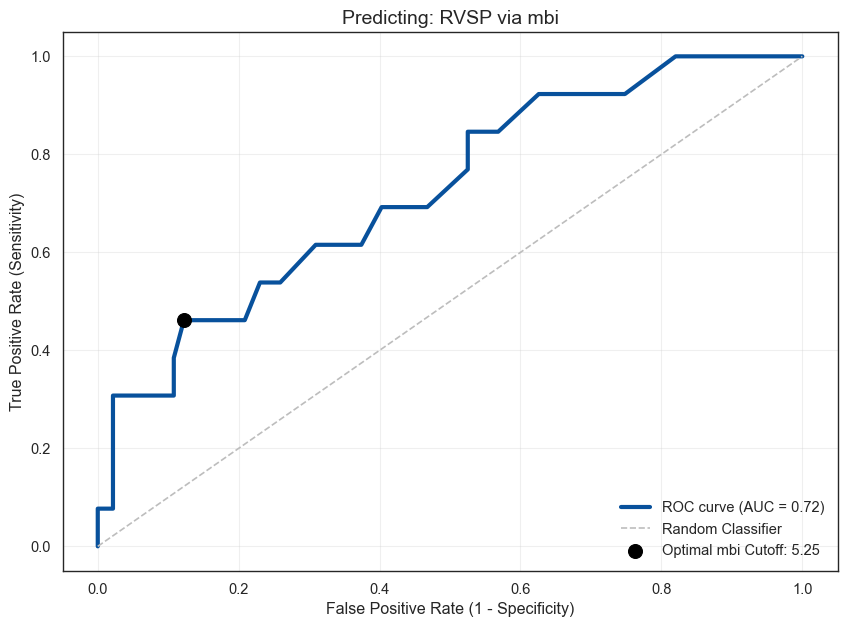
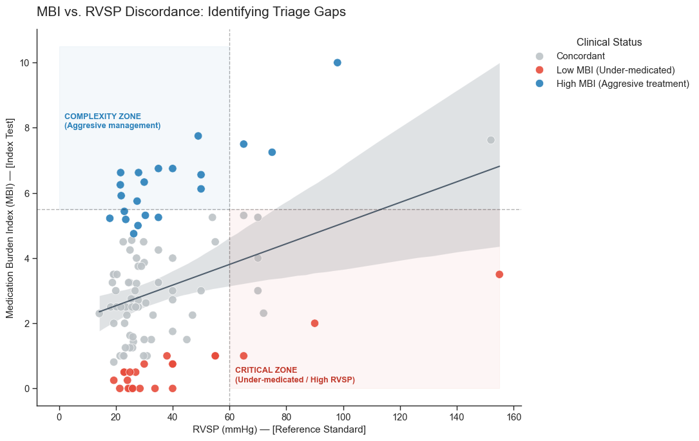
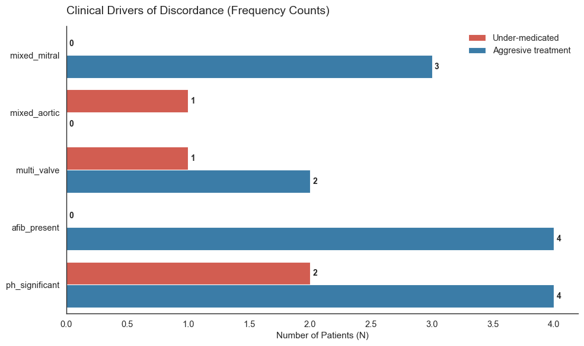

# Quantifying Clinical Gaps in Valvular Heart Disease: Using the Medication Burden Index (MBI) to Triage High-Complexity Intervention Candidates.
## 📄 Executive summary

| Section | Content |
|:---|:---|
| **Context**|International Cardiology mission phase 1 (2025 cohort) analysis of Valvular Heart Disease in León, Nicaragua|
| **Challenge** | In a 10-day high-volume "clinical sprint," cardiologists often skip fields for healthy valves: If a valve is normal, the entry is left blank to save time. This creates Missing Not At Random (MNAR) bias. |
| **Strategy** | Natural Normal Imputation: Gaussian noise centered around healthy means (e.g., RVSP $25 \pm 4 \text{ mmHg}$) to restore the statistical variance of a healthy population. |
| **Key metric** | Medication Burden Index (MBI): A quantitative surrogate for clinical complexity and pulmonary hypertension based on pharmacological intensity. |
| **Outcome** | MBI-based triage proposal for identification of complex and high risk patients. |

## 📑 Table of Contents

* [Outcome: MBI-driven Triage](#-outcome-mbi-driven-triage)
* [Data Context](#-data-context)
* [Technical Structure](#-technical-structure)
* [Database Schema and Governance](#-database-schema-and-governance)
* [Centralized Domain Governance](#-centralized-domain-governance)
* [Feature Engineering and Bias Mitigation](#️-feature-engineering-and-bias-mitigation)
  * [The Medication Burden Index (MBI)](#the-medication-burden-index-mbi)
  * [Imputation to restore physiologic variance](#imputation-to-restore-physiologic-variance)
* [Cohort analysis and triage zone boundaries](#-cohort-analysis-and-triage-zone-boundaries)
* [Dashboard deployment](#-dashboard-deployment)

## 📊 Outcome: MBI-driven triage
The MBI score serves as a robust proxy for anatomical complexity and critical hemodynamic compromise (AUC: 0.82).


Based on the cohort analysis, these thresholds guide the intake staff in prioritizing patients.

| MBI Range | Triage Zone | Clinical Interpretation |
|---:|:---|:---|
| **< 4.0** | **Zone 1: Standard** | Likely compensated. |
| **4.0 - 5.25** | **Zone 2: Complex** | Optimal intervention area: High probability of hemodynamic complexity. |
| **5.25 - 5.5** | **Zone 3: Critical** | 85% Precision for Critical Pulmonary Hypertension ($RVSP > 60~mmHg$). |
| **> 5.5** | **Zone 4: Futility risk** | Intervention risk likely outweighs potential hemodynamic gain. |

## 🔎 Data context

This project analyzes real-world clinical data from a high-volume medical mission in León, Nicaragua. The cardiology brigade operates via a structured, three-phase clinical workflow designed to bridge the gap between primary screening and advanced cardiac intervention:

* **Phase 1 — General Cardiology Clinic:** High-throughput diagnostic screening, echocardiographic evaluation, and procedure prioritization.

* **Phase 2 — Electrophysiology:** Arrhythmia management, including cardiac ablations and permanent pacemaker/ICD implantation.

* **Phase 3 — Interventional Cardiology:** Percutaneous structural heart procedures and collaborative case reviews.

This analysis focuses on the Phase 1 - 2025 Cohort. To ensure clinical relevance and focus on adult structural heart disease, the population was filtered as follows:  

* **Initial Enrollment:** $N=187$ patients.

* **Exclusion Criteria:** Patients $< 15$ years old or those with entirely normal echocardiographic findings (no disease criteria met).

* **Final Analytical Sample:** $N=152$ patients.


## 💻 Technical structure
### Project Schema
```text
├── data/
│   ├── raw/                                    # Original CSV
│   └── processed/                              # Post-Transformation data
├── modules/                                    # Tableau files
│   └── config.py                               # Python configuration dictionaries
├── notebooks/
│   ├── 01_extraction_transformation.ipynb      # Extraction & Transformation
│   ├── 02_loading.ipynb                        # MySQL connector script
│   └── 03_analysis.ipynb                       # Data Analysis
├── sql/                                        # SQL-related files
│   └── schema_cardio_mbi.mwb                   # MySQL database schema
├── tableau/                                    # Tableau files
├── assets/                                     # Auxiliary files for documentation
├── requirements.txt                            # Python library dependencies
└── README.md
```

## 💽 Database schema and governance
To transition this dataset from a flat file to an analytics-ready warehouse, the database layer implements a **5-table Snowflake Schema** . While this structure enforces **Third Normal Form (3NF)** compliance across core tables to eliminate update anomalies, it implements a pragmatic, **denormalized hybrid strategy** within the associative entities to optimize analytic queries:

* **Data Governance & Privacy:** All underlying source rows have been completely stripped of Protected Health Information (PHI) identifiers, ensuring full anonymization and alignment with international medical data privacy standards before pipeline ingest.
* **Entity Isolation:** Patient-level continuous demographics and baseline variables are strictly isolated within `fact_patient`, anchoring the baseline denominator ($N=152$).
* **Nomenclature Normalization:** Dimension tables `dim_diagnoses` and `dim_medications` function as a single source of truth, enforcing clean text constraints and eliminating manual string typographical variances.
* **Many-to-Many Resolution:** Complex multi-valvular disease records and polypharmacy exposures are decoupled into dedicated bridge tables (`bridge_diagnoses` and `bridge_medications`). This database design allows to execute localized cohort queries without duplicating core patient parameters.  
* **Programmatic Pipeline Execution:** The complete schema instantiation and transactional loading sequence are engineered natively in Python using `mysql-connector-python`.


## 🧠 Centralized Domain Governance

To ensure pipeline reproducibility and maintainability, this project decouples clinical domain parameters from database execution. All diagnostic thresholds, severity schemas, and pharmacological weights are encapsulated within a centralized, object-oriented master registry: `ClinicalConfig`.

By isolating these parameters from the underlying data engineering code, `config.py` serves as the **Medical Brain** of the stack—eliminating the anti-pattern of scattering hardcoded numbers across separate notebook cells.

```python
# Conceptual structure of the centralized configuration dictionaries
class ClinicalConfig:
    def __init__(self):
        # Severity and scoring maps for valvular disease
        self.severity = { 'critical': 3.5, 'severe': 3.0, 'moderate': 2.0, 'none': 0.0 }

        # Medication classes and their weights based on the targeted clinical conditions 
        self.class_weights = {
            'Diuretics_Loop': 3.0,          # Marker of active congestive heart failure / fluid overload
            'RAAS_Inhibitors': 2.0,         # Standard neurohormonal blockade for ventricular remodeling
            'Calcium_Channel_Blockers': 1.0,           # Baseline hypertension maintenance therapy
        }

        # Physiological parameter and their bounds for Gaussian Imputation
        self.normal_variables = {
            'MS MG (mmHg)': (1.5, 0.5), # (Mean, Std Dev)
            'RVSP': (25.0, 4.0)
        }
```

## 🛠️ Feature engineering and bias mitigation
### The Medication Burden Index (MBI)
The MBI transforms fragmented medication lists into a single, actionable score that quantifies how aggresively a patient is being medically managed, which serves as a proxy for both physiological severity and care complexity.

We define the score mathematically as:

$$MBI = \sum \left( \text{Class Weight} \times \frac{\text{Total Daily Dose}}{\text{Maximum Daily Dose}} \right)$$

* **Dose Ratio:** The total milligrams consumed by the patient in 24 hours. For example, a patient on Furosemide 40mg every 12h has a $TDD=80~mg$.

* **Weight:** Based on the drug's therapeutic impact for valvular heart disease (e.g., Loop Diuretics have a higher weight than Lipid Lowering agents).

| Weight | Priority | Medication Classes |
|---:|:---|:---|
| **3.0** | Critical | Loop diuretics, pulmonary vasodilators. |
| **2.0** | High | RAAS inhibitors, beta-blockers, SGLT2 inhibitors. |
| **1.0** | Moderate | Anticoagulants, calcium channel blockers. |
| **0.5** | Maintenance | Statins. |

**Implementation example: Normalizing calcium channel blockers (CCBs)**

To ensure the MBI reflects true clinical intensity rather than raw milligrams, we normalize dosages against their therapeutic ceilings. Consider two patients on Calcium Channel Blockers (CCBs):

| Patient | Medication | Raw dosage | Frequency | Total Daily Dose (TDD) | Maximum Daily Dose (MDD) | Dose ratio |
| :- | :- | -: | :- | -: | -: | -: |
| A | **Nifedipine** | 20 mg | BID | 40 mg | 120 mg | 0.33 |
| B | **Amlodipine** | 10 mg | QD | 10 mg | 10 mg | 1.00 |

**Clinical Insight:** Despite Patient A taking a higher milligram count (40mg vs 10mg), Patient B is at a higher therapeutic intensity (100% of max dose). The MBI correctly captures this higher therapeutic intensity for Patient B, which would be lost in a non-normalized dataset.

### Imputation to restore physiologic variance

#### The Problem: The "Silence of the Normal" (MNAR bias)

In a 10-day clinical sprint, data is recorded on physical paper charts at the bedside. This workflow creates a specific form of bias: Missing Not At Random (MNAR).

In high-volume brigade settings, "Missingness" is a clinical surrogate for "Normal." A cardiologist under extreme time pressure will prioritize documenting a pathological $1.2 cm^{2}$ Mitral Valve area but will likely leave the Aortic Valve field blank if it appears healthy. Standard imputation (mean/median) would erroneously assign "diseased" values to these healthy valves, leading to Model Alarmism and an overestimation of cohort severity.

#### The Strategy: "Natural Normal" Imputation

To preserve the statistical integrity of the cohort and prevent pathology bias, we utilize a **Natural Normal Imputation** strategy. Instead of treating nulls as errors, we treat them as "Healthy Proxies" and inject physiological noise centered around healthy clinical variables to approximate the natural variance of the population:

$$X_{imp} \sim \mathcal{N}(\mu_{healthy}, \sigma^{2}_{phys})$$

*Example:* For a missing Right Ventricular Systolic Pressure (RVSP), we assume a "normal" physiological state. Rather than imputing the cohort mean (which may be elevated due to severe mitral disease), we impute values centered around $25\text{ mmHg}$ with a small standard deviation ($\sigma \approx 4\text{ mmHg}$). This reflects a healthy pulmonary pressure range of $19\text{--}31\text{ mmHg}$.

#### Imputation sensitivity analysis
We plot **measured** (grey) vs. **imputed** (blue) to visually compare the distributions before and after the injection of Gaussian noise.


| Parameter | Measured mean | Imputed mean | Delta |
| :- | -: | -: | :- |
| MS MG (mmHg)  | 11.4 | 3.8 | -7.6 | 
| AO V2 max | 4.3 | 1.6 | -2.6 | 
| RVSP | 51.0 | 33.6 | -17.5 | 
| LVIDd | 5.2 | 4.8 | -0.4 | 

The table reveals a Significant Shift in means for hemodynamic variables, such as RVSP dropping from 51.0 mmHg (measured) to 33.6 mmHg (imputed). This delta is the mathematical proof of a **High-Severity Documentation Threshold**. It confirms that clinicians only performed time-intensive quantitative measurements when a preliminary "Quick Scan" indicated significant pathology—leaving the healthy portion of the population "silent" but present.

## 📈 Cohort analysis and triage zone boundaries
### 1. Statistical Baseline & Cross-Stratification
To map the mathematical interaction between physiological degradation and active medical suppression, the cohort is cross-examined across distinct phenotypic grains. 

The tables below provide the statistical baseline backing our triage logic, demonstrating how clinical indicators shift across the MBI triage boundaries (Table 1) and across historical surgical interventions (Table 2).

#### Table 1: Clinical Cohort Characteristics by MBI Triage Zone

| Clinical Metric | All Patients (N=152) | Zone 1 (n=113) | Zone 2 (n=22) | Zone 3 (n=17) |
| --- | --- | --- | --- | --- |
| **Age (years)** | $47.1 \pm 15.7$ | $45.3 \pm 16.4$ | $54.6 \pm 10.1$ | $49.8 \pm 13.4$ |
| **Female (%)** | $64.5\%$ | $58.4\%$ | $77.3\%$ | $88.2\%$ |
| **Heart Rate (bpm)** | $76.6 \pm 14.1$ | $76.2 \pm 14.2$ | $79.5 \pm 14.2$ | $75.8 \pm 14.1$ |
| **Systolic BP (mmHg)** | $124.6 \pm 18.7$ | $127.4 \pm 18.7$ | $113.6 \pm 17.0$ | $120.9 \pm 15.2$ |
| **Diastolic BP (mmHg)** | $76.7 \pm 12.5$ | $77.7 \pm 12.9$ | $72.9 \pm 10.3$ | $75.2 \pm 11.6$ |
| **RVSP (mmHg)** | $33.3 \pm 20.3$ | $30.7 \pm 17.2$ | $35.5 \pm 16.2$ | $48.0 \pm 34.3$ |
| **LVEF (%)** | $58.2 \pm 11.4$ | $59.3 \pm 10.5$ | $54.4 \pm 14.5$ | $56.1 \pm 12.1$ |
| **MBI** | $2.9 \pm 2.1$ | $1.9 \pm 1.2$ | $4.7 \pm 0.5$ | $7.2 \pm 1.3$ |

#### Table 2: Clinical Baselines by Intervention

| Biomarker / Metric | All Patients (N=152) | Native (n=110) | Percutaneous (n=17) | Surgical (n=25) |
| --- | --- | --- | --- | --- |
| **Age (years)** | $47.1 \pm 15.7$ | $47.7 \pm 16.0$ | $42.9 \pm 14.4$ | $47.4 \pm 14.9$ |
| **Female (%)** | $64.5\%$ | $61.8\%$ | $88.2\%$ | $60.0\%$ |
| **Heart Rate (bpm)** | $76.6 \pm 14.1$ | $76.3 \pm 14.5$ | $71.2 \pm 13.2$ | $81.5 \pm 11.8$ |
| **Systolic BP (mmHg)** | $124.6 \pm 18.7$ | $124.8 \pm 19.4$ | $123.8 \pm 18.2$ | $124.7 \pm 16.3$ |
| **Diastolic BP (mmHg)** | $76.7 \pm 12.5$ | $76.6 \pm 13.6$ | $75.7 \pm 9.7$ | $77.7 \pm 8.2$ |
| **RVSP (mmHg)** | $33.3 \pm 20.3$ | $35.8 \pm 22.6$ | $30.3 \pm 13.7$ | $24.3 \pm 3.7$ |
| **LVEF (%)** | $58.2 \pm 11.4$ | $57.1 \pm 13.1$ | $60.2 \pm 3.9$ | $62.0 \pm 0.0$ |
| **MBI** | $2.9 \pm 2.1$ | $3.0 \pm 2.2$ | $3.2 \pm 2.6$ | $1.9 \pm 1.4$ |

### 2. Receiver Operating Characteristic (ROC) Threshold Optimization

To rigorously validate the **Medication Burden Index (MBI)** as a high-precision diagnostic proxy for hemodynamic risk, a Receiver Operating Characteristic (ROC) curve analysis was executed against the cohort's reference standard standard: **Significant Pulmonary Hypertension (PH)**, defined clinically as an $\text{RVSP} \ge 60\text{ mmHg}$.



#### Algorithmic Performance Metrics
* **Area Under the Curve (AUC):** **$0.72$** 
  * *Interpretation:* An AUC of $\approx 0.72$ establishes that the MBI possesses strong discriminative capacity to distinguish between managed baseline states and severe secondary hemodynamic failure purely from a patient's pharmacological footprint.
* **Optimal Cutoff Threshold (Youden's J Index):** **$5.25$**
  * *Statistical Trade-off:* This mathematically optimizes the balance between sensitivity and specificity, providing the exact empirical boundary utilized to define the transition from **Zone 2** into the **Zone 3 Critical Tier**.

#### Methodological Paradox: Maximizing PPV for Triage Optimization
In classic diagnostic classification tasks, an algorithmic **Recall (Sensitivity) of 0.17** might be flagged as under-optimized. However, within the context of a clinical evaluation sprint, prioritizing **Positive Predictive Value (PPV = 0.94)** serves a profound clinical function:

1. **Rule-In Precision (PPV = 0.85):** If the MBI model issues an alert for severe, high-complexity risk, it is mathematically correct 94% of the time (under a 6% false-positive threshold). This provides international surgical screening brigades with an absolute, rapid "Rule-In" mechanism for prompt coordinating validation Transesophageal Echocardiography (TEE).
2. **Quantifying the Care Gap:** The remaining 68% of patients who exhibit high anatomical complexity on echo but maintain a low MBI are not standard errors; they represent the **true unoptimized care gap**—patients who are severely structurally deteriorated but completely lack appropriate therapeutic coverage due to regional medical access boundaries.

By leveraging the ROC-optimized $5.25$ cutoff, the engine moves beyond a theoretical classifier—it establishes a standardized, objective framework for immediate field triage.

### 3. The Regression Mismatch (Care Gap)

We modeled the relationship between a patient's **Medication Burden Index (MBI)** and their **Right Ventricular Systolic Pressure (RVSP)**. Instead of treating the residuals of this model as noise, this pipeline identifies the **statistical mismatch** to identify potential care gaps.

#### Visualizing Diagnostic Discordance & Clinical Phenotypes

Mapping the interaction between physiological stress and therapeutic suppression helps us reveal a more complex clinical reality. To expose these hidden phenotypes, the cohort's diagnostic profile is evaluated across two distinct analytical lenses:



* **MBI vs. RVSP Analysis:** This plot maps individual patient positions by crossing the Medication Burden Index (Index Test) against Right Ventricular Systolic Pressure (Reference Standard). The shaded regression interval represents the expected trend of **Concordant** disease progression. Crucially, this visualization highlights two highly problematic diagnostic deviations:
  * **The Complexity Zone (Blue):** Patients demonstrating artificially suppressed or "moderate" hemodynamics achieved only via exceptional, high-intensity pharmacological management.
  * **The Critical Zone (Red):** Under-medicated individuals exhibiting advanced hemodynamic failure relative to their therapeutic coverage.



* **Clinical Drivers of Discordance:** To move past abstract data distribution, this frequency breakdown isolates the specific pathophysiological etiologies (e.g., mixed mitral disease, atrial fibrillation) that actively fuel these discordant states, pinning down the underlying clinical triggers forcing patients out of equilibrium.

By evaluating where patients fall relative to the expected concordant baseline, we can deconstruct the true physiological toll required to maintain superficial stability.

<div style="padding: 15px; border: 1px solid #003152; border-radius: 5px; background-color: #eff9ff; color: #003152;">
<strong style="font-size: 1.2em;">Deep Dive: The Pharmacological Cost of Hemodynamic Stability</strong>

<p><b>1. The SBP "Warning Light":</b> A critical discovery in the <b>Zone 2 (MBI 4.0 - 5.25)</b> and <b>Aggressive Treatment</b> cohorts is the significant drop in <b>Systolic BP (113.6 - 116.2 mmHg)</b> compared to the stable cohort (~127 mmHg). This indicates that high pharmacological intensity is successfully lowering afterload and managing congestion, but the patient is operating at their <i>physiological limit</i>. In a mission setting, these patients are "fragile-stable"—one missed dose away from a crisis.</p>

<p><b>2. The "Masked" Discordance (The Complexity Zone):</b> Table 1 identifies the <b>Aggressive Treatment (n=17)</b> group as the most clinically deceptive. Despite having an <b>RVSP (48.0 mmHg)</b> that appears "moderate" on an Echo, they require an <b>MBI of 7.2</b> (the highest in the study) to maintain that pressure.</p>

<p><b>3. Threshold Validation (The 5.25 Red Flag):</b> Table 2 validates <b>Zone 3 (MBI > 5.25)</b> as the true "Danger Zone." This cohort captures the highest mean <b>RVSP (48.0 ± 34.3 mmHg)</b> and the highest percentage of females (88.2%). This suggests that as the MBI crosses the 5.25 mark, the "masking" effect of medication is overwhelmed by the underlying disease, making this the optimal cutoff for intervention triage.</p>

<p><b>4. Re-Normalizing the "Native Constant" (Table 3):</b> The <b>Surgical</b> cohort presents a fascinating benchmark. Their <b>MBI (1.9)</b> and <b>RVSP (25.1)</b> are the lowest in the entire study, while their <b>LVEF (60%)</b> is the highest. This proves that successful intervention "resets" the Native Constant. The heart is no longer struggling (low MBI) and is no longer over-contracting (normal LVEF), representing the goal of the cardiology mission.</p>
</div>
---

## 📊 Dashboard Deployment

To move these analytical insights from the notebook to the clinical frontlines, the clean data infrastructure is mirrored into an interactive Tableau deployment. This allows field coordinators to filter the complete $N=152$ cohort across specific diagnostic sub-groups dynamically.


* **Dynamic Patient Profiling:** Cross-filters clinical registries instantly across disease categories.
* **Real-time Stratification:** Renders real-time patient rosters partitioned into their corresponding MBI Triage Zones to help streamline surgical planning rounds during active medical sprints.